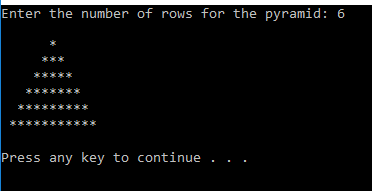

General Requirements:
a) For each of the following questions, you must first construct 	a Java program which is limited to using:

a. addition and/or subtraction
b. contains just a main method
c. has only global static variables (no local variables)
d. can use loops
e. can use single dimension arrays (as long as they are global and static)

You cannot use:
a. Local variables
b. IF/SWITCH statements
c. Multiplication, division, modulus
d. Math library functions

b) The IRVINE library will be used in all the programs.

Questions: Produce both Java and Assembly programs for all

A) To collect an unsigned integer value from a user, you need to first ask a question and then collect the response. To ask a question in assembly, you can use the WriteString library function to print a string by placing the offset of the string in the EDX register and then call the function. Use the ReadDec library function to collect the unsigned integer value. The value is returned in the eax register. To collect a signed integer, the ReadInt library function is used instead.

Write a program which prompts the user to enter five numbers and store the numbers into five double word variables, P, Q, R, S, & T, in the data segment. Each prompt must be different and specific. P R and T are unsigned values whereas Q and S are signed values. Once collected, use the five values to solve and report the results for each of the following equations using only the EBX and EAX registers:

(2P + R) - (Q - S) - 3T
(2P + 4R) -(S + Q) +2T
8R - (S + Q) - (3T + P)

To print a signed integer number, you would make sure the number to print is in the EAX register and then call the WriteInt library function. 

Your output should look something like: 
(2P + R) - (Q - S) - 3T = +453 
(2P + 4R) - (S + Q) + 2R = +1836 
8R - (S + Q) - (3T + P) + R = -49

B) Write a program which asks the user for the number of rows in a pyramid and then constructs a pyramid using asterisk with the specified value. The first row of the pyramid, which we will call row 0, will have 1 asterisk, the second row (called row 1), will have 3 asterisks, row 2 will have 5 asterisks, etc. The number of asterisks in a given row called row x will therefore be 2 * x +1. The output would look something like this:
Sample output 1: (taken from Eclipse)

Sample output 2: (taken from Visual Studio)

Hint: To print a single character, put the character in the AL register and call WriteChar.
mov al, '*' and then call WriteChar

C) Write an assembly program that uses a loop to calculate the first thirty values of a number sequence described by the formula: F(1) = 1, F(2) = 1, F(3) = 3, F(4) = 6, and then F(n) = F(n-1) * 2 + Fib(n-4) * 3 for n >=5. Your program needs to print the values as a comma separated – the first four values are simply printed and the remaining values are calculated using a loop.

Place each value in the EAX register and display it using the WriteDec library function. Use the WriteString library function to print a string ", ",0 which is a comma, a space and a null terminator and the CrLf function to print a newline character when you are finished. The output would be something like:
1, 2, 3, 2, 5, 12, 27, 56, 117, ...

D) Design a program which has an array with 6 elements - initially, the date type should be BYTE. Your program will:

a. Display the items as signed integer values in a comma and space separated list. (The last item can NOT have a comma after it. Remember, you can't use an IF statement type structure.) End the list with a carriage return and line feed.

b. Display the items as HEX values in a command and space separated list. (Again, the last item can NOT have a comma after it.) End the list with a carriage return and line feed. For this requirement, the BYTE values should be just 2-digit HEX numbers and the WORD values should be 4-digit HEX numbers. This can be accomplished using one of the IRVINE library functions (Read the list in chapter 5 carefully).

c. Total the numbers in the array together and display the total with an appropriate message as a signed integer value.

d. Your program must be adaptable.

i. If elements are added to or removed from the array (and they will be), the program must continue to work correctly. This alteration would simply be adding or removing items in the array - no code changes or changes to constants will be made.
ii. If the array is changed from BYTE to WORD in the data section (with no other code changes), the program must continue to work correctly.
