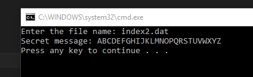

A) Linking Array Items.

Your job is to follow the letters from the starting position until 26 letters have been printed. There will still be two BYTE arrays, the first one named letters which will contain exactly 26 letters, and a second array named index which will hold 27 index values. The data for both of the arrays will be provided in a binary file - the test file being called index2.dat. You must read the initial data from the test file

This program will perform the following steps:

a) Ask the user for the name of the data file.
b) Open the file using the OpenInputFile library function. Make sure you save the file handle returned in EAX because you will need it later
c) Using the ReadFromFile library function, read the first 26 bytes into the letters array.
d) Using the ReadFromFile library function, read the next 27 bytes from the file into the index array.
e) Close the file connection using the file handle and the CloseFile library function.
f) The initial index value will be the last byte of the index array. Get this value and then print the 26 character message by following the index. For example, if the start index is 10, then you would first print the character at letters[10] and get the next index value from index[10]. Use the next index to find and print the next letter and find the index value of the 3rd letter. Repeat this process until 26 letters have been printed.

B) BetterRandomRange Procedure
Create a test program that asks the user for a lower number and an upper number – and then generate a random number from the lower number to the upper number. The questions should be repeated 5 times before stopping. Make sure you use the Randomize library function in your program (it only needs to be called once).

C) CrazyArt Program

